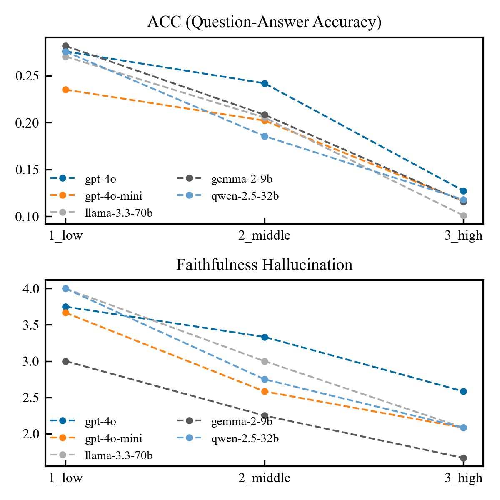

## このアプリケーションは自律型生成AIエージェントによるアプリケーション作成の実験用です。
本プロジェクトはその最初の段階として、Claude 3.7 sonnetと人間によるコピー&ペースト編集及び統合テストフィードバック（エラーレポート）により作成されました。
初期コード生成のプロンプト、フィードバックのプロンプトとClaudeの出力はISSUEに添付しています。
このREADME.mdの一部( <以下は生成されたREADME>より上)、ISSUE、スクリーンショット画像を除いた全てのテキストはClaude 3.7 sonnetによる出力です。

次のステージとして、自律型生成AIエージェントのみによる完全な開発を行います。

### 1. 動作
Google Colaboratoryのみで動作確認しています。（2025/3/6時点で、Azure OpenAI APIのMap reduceはエラーが出ています）

[](https://colab.research.google.com/drive/1rawlZkhjdfo-YKKbBmxYYbm0EjfjMVRh?usp=sharing)

**Google Colaboratoryで生成AI機能をonにすると、入力内容がAIの学習に利用されます。そのため、機密情報や個人情報をcolabノートブックへ入力及び、本アプリケーションへの入力はしないでください（ログを出力することでcolaboの生成AIへの入力となります）。また、APIキーをノートブック上に直接書かないでください**

### 2. API KEYの設定
以下のように、シークレットにAPIキーを設定してください。


### 3. APIの発行方法
#### Deepgram
https://deepgram.com/
2025/3/6時点で$200分のクレジットがもらえ無料で試すことができます。

#### Groq
https://groq.com/
2025/3/6時点で無料で試すことができますが、1分及び1日でRate limitがあります。

### テンプレート
Wordファイルに挿入したい場所に抽出したい内容を{{XXXX}}と記載してください（例 {{宿題}}、{{主題}}、{{決定事項}}など）。LLMによる抽出結果で置換されます。要約を挿入したい場所には{{要約}}と記載してください。


### 4. パフォーマンス（人間が評価を実施。モデル選択の参考にしてください。）
12個の原稿データからノイズを含む文字起こしを作成し、要約のパフォーマンスを簡単に評価しています（サンプルサイズが少ないため解釈は限定的になります）。
元原稿データをGoogle text-to-speech (Gtts)で読み上げ、3段階のホワイトノイズを付与した音声データセットを作成し、Whisper-V3-largeによりノイズ有り文字起こしデータセットを作成します。
ノイズ有り文字起こしデータを各LLMにインプットし、要約を作成します。
``` prompt
次は音声から文字起こしをしたものです。似た音の単語を誤認識している可能性に注意して日本語で要約してください。
```

#### Question-Answering Accuracy
元原稿データから(Question, Answer)ペアをGPT-4oで生成し、提供された要約を根拠に生成したQuestionに回答できるかで評価。回答の一致はRouge-f1値により判定し、平均値[0,1]で評価

#### Faithfulness Hallucination
LLM-as-a-judge (gpt-4o)による元原稿データからの逸脱の少なさを5段階で評価

##### 評価スケール
```
5:"提供された要約に、文字起こしに記載されていない情報が含まれていない"
4:"提供された要約に、文字起こしに記載されていない情報が1つのみ含まれている"
3:"提供された要約に、文字起こしに記載されていない情報が2つ含まれている"
2:"提供された要約の半分程度は、文字起こしに記載されていない情報である、または、文字起こしの記載と大きく矛盾する情報が1つ以上含まれている"
1:"提供された要約のほとんどは、文字起こしに記載されていない情報である、または、文字起こしの記載と大きく矛盾する情報が1つ以上含まれている"
```
#### 結果
gpt-4oはノイズにより誤りを含む文字起こしに対して比較的ロバストである


### 5. 出力の利用制限
こちらのアプリケーションの出力に関して、選択したモデルによって以下の利用制限が生じます。ご確認ください。
##### Llamaモデルを利用した場合:
https://github.com/meta-llama/llama-models/blob/main/models/llama3_1/LICENSE
##### Gemmaモデルを利用した場合:
https://ai.google.dev/gemma/terms
##### Azure openAI
https://openai.com/policies/row-terms-of-use/

## <以下は生成されたREADME>

## 音声文字起こし・要約Q&Aアプリケーション

このアプリケーションは音声ファイルから文字起こしを行い、LLMを用いた要約や質疑応答機能を提供するウェブアプリケーションです。

## 機能

- **音声文字起こし**: Deepgram APIまたはGroq Whisper APIを使用
- **テキスト要約**: Azure OpenAI APIまたはGroq API (LLama 3.3/Gemma-2)を使用
- **質疑応答**: 文字起こしデータに基づいた質問応答
- **議事録テンプレート**: Word形式の議事録テンプレートへの自動挿入
- **複数形式でのエクスポート**: Word、テキスト、JSONでのダウンロード

## セットアップ手順

### 必要な環境

- Python 3.8以上
- 以下のサービスのAPIキー:
  - Azure OpenAI
  - Deepgram
  - Groq

### Google Colabで実行する場合

1. このリポジトリをGoogle Colabにクローンします。
2. Google Colabのシークレット機能でAPIキーを設定します。
   - `OPENAI_API_KEY`
   - `DEEPGRAM_API_KEY`
   - `GROQ_API_KEY`
   - `AZURE_OPENAI_KEY`
   - `AZURE_OPENAI_ENDPOINT`
3. `run_in_colab.ipynb`ノートブックを開いて実行します。

### ローカルで実行する場合

1. リポジトリをクローンします。
   ```
   git clone https://github.com/your-username/audio-transcription-app.git
   cd audio-transcription-app
   ```

2. `run_local.py`スクリプトを実行します。
   ```
   python run_local.py
   ```
   
   このスクリプトは以下のことを行います:
   - 環境のチェック
   - 必要に応じて仮想環境の作成
   - 依存パッケージのインストール
   - APIキー設定の確認
   - アプリケーションの起動

3. `.env`ファイルにAPIキーを設定します。
   ```
   OPENAI_API_KEY=your_openai_api_key
   DEEPGRAM_API_KEY=your_deepgram_api_key
   GROQ_API_KEY=your_groq_api_key
   AZURE_OPENAI_KEY=your_azure_openai_key
   AZURE_OPENAI_ENDPOINT=your_azure_openai_endpoint
   ```

4. ブラウザで`http://localhost:5000`を開きます（スクリプトが自動的に開きます）。

## 手動セットアップ

手動でセットアップする場合は以下の手順に従ってください：

1. 必要なパッケージをインストールします。
   ```
   pip install -r requirements.txt
   ```

2. セットアップスクリプトを実行します。
   ```
   python setup.py
   ```

3. `.env`ファイルにAPIキーを設定します。

4. アプリケーションを起動します。
   ```
   python -m flask run
   ```

## 使用方法

1. **ファイルアップロード**: 音声ファイル（mp3, wav, m4a等）をアップロードします。必要に応じて議事録テンプレートもアップロードできます。

2. **文字起こし**: アップロードした音声ファイルに対して文字起こしを実行します。DeepgramかGroq Whisper APIを選択できます。

3. **要約**: 文字起こしされたテキストの要約を生成します。Azure OpenAI APIかGroq APIを使用できます。

4. **質疑応答**: 文字起こしされたテキストに対して質問をすることができます。

5. **ダウンロード**: 文字起こし結果、要約、質疑応答をまとめたレポートをダウンロードできます。複数のフォーマット（docx, txt, json）から選択できます。

## 注意事項

- 長時間の音声ファイルは自動的に分割して処理されます。
- APIキーの使用には各サービスの利用規約に従ってください。
- APIの呼び出しには料金が発生する場合があります。

## トラブルシューティング

- **APIキーエラー**: `.env`ファイルまたはGoogle Colabシークレットでキーが正しく設定されているか確認してください。
- **音声ファイルエラー**: サポートされている形式（mp3, wav, m4a）であることを確認してください。
- **依存関係エラー**: `pip install -r requirements.txt`を再実行してください。
- **ポート競合**: 既定のポートが使用中の場合は、別のポートを指定して実行してください。

## 動作の流れ

ユーザーがWord形式のテンプレートファイルをアップロード
ユーザーが音声ファイルをアップロードして文字起こし処理を実行
「ダウンロード」タブで出力形式やAPIを選択して「レポート生成」をクリック
バックエンドでは以下の処理が行われる：

テンプレートファイルからプレースホルダを抽出
文字起こしデータからLLMを使って各プレースホルダに対応する情報を抽出
テンプレート内のプレースホルダを抽出した情報で置換
文字起こし全文や質疑応答データを追加
生成した文書を保存


ユーザーが生成された文書をダウンロード

## 注意点

プレースホルダの形式は必ず {{プレースホルダ名}} の形式である必要があります。
「要約」という名前のプレースホルダがある場合は、LLMによる抽出ではなく、別途生成された要約テキストが使われます。
LLMによる情報抽出の精度は、文字起こしデータの品質や内容によって変わります。
テンプレートに含まれるプレースホルダは重複なしのリストとして抽出されます。

この実装により、会議の文字起こしデータから自動的に議事録を生成する機能が大幅に強化され、ユーザーの手間を減らすことができます。
